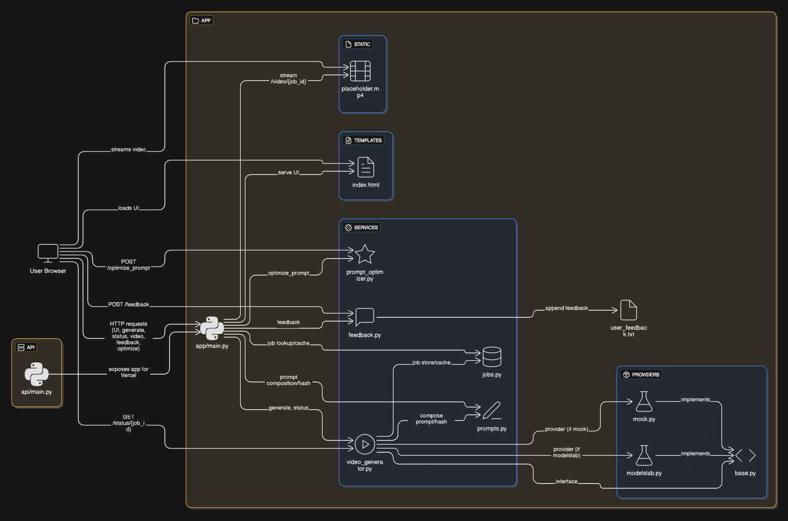

# 🎥 Peppo Video App – AI-Powered Text to Video Generator

[](https://vercel.com/new/clone?repository-url=https://github.com/suryansh-sr-17/peppo-video-app-replicate-r1)
[](https://python.org)
[](https://fastapi.tiangolo.com)
[](https://replicate.com)

24 hour Technical Challenge: A simple, provider-agnostic web app that helps generate **videos** from **text ideas** and **optimized prompts** using AI.

- ⚡ **FastAPI** backend with **Replicate** integration
- 🎬 **Real video generation** using Pixverse text-to-video model
- ✨ **AI prompt optimization** with OpenAI GPT-4o-mini
- 🗂️ Clean provider-based architecture
- 🔑 **API key configurable** via environment variables
- 🌍 **Deployable on Vercel** with serverless functions

---

## 🎬 Demo Video

> **See the app in action!** Watch how easy it is to generate AI videos from text prompts.

[](https://github.com/suryansh-sr-17/peppo-video-app-replicate-r1/blob/master/demo/peppo_final_demo.mp4)

[🎬 **Click here to watch the full demo**](https://github.com/suryansh-sr-17/peppo-video-app-replicate-r1/blob/master/demo/peppo_final_demo.mp4)

*See text-to-video generation with prompt optimization in action.*


---

## 🌐 Demo

👉 Live App URL: [Coming Soon - Deploy to Vercel](https://vercel.com/new/clone?repository-url=https://github.com/suryansh-sr-17/peppo-video-app-replicate-r1)

---

## ✨ Features

- 🎬 **Real Video Generation**: Generate 5-8 second videos from text prompts using Replicate's Pixverse model
- 🤖 **AI Prompt Optimization**: Enhance your prompts using OpenAI's GPT-4o-mini for better video results
- 🎨 **Style Presets**: Choose from cinematic, anime, or product styles with optimized parameters
- 💾 **Smart Caching**: Identical prompts return cached results instantly for efficiency
- 📱 **Responsive UI**: Clean, modern interface that works on desktop and mobile
- ⚡ **Fast API**: RESTful API built with FastAPI for high performance
- 🔄 **Real-time Status**: Live updates on video generation progress
- 🎯 **Provider Architecture**: Easily extensible to support multiple video generation providers

---

## 📂 Project Structure

```bash
.
├── api/                      # API endpoint
├── app/                      # Core application logic
│   ├── providers/            # External provider integrations
│   ├── services/             # Business logic and services
│   ├── static/               # Static files
│   ├── templates/            # HTML templates
│   ├── main.py               # entrypoint
│   └── user_feedback.txt     # For user feedback and development cycle
├── test_scripts/             # Development and testing utilities
├── .env.example              # Sample API Key configurations
├── DEPLOYMENT.md             # Vercel deployment guide
└── README.md                 # Project documentation
```

---

## 🧭 Application Workflow

> **Workflow Diagram**
>
> 

---

## ⚙️ Run Locally

```bash
# 1. Clone the repo
git clone https://github.com/suryansh-sr-17/peppo-video-app-replicate-r1.git
cd peppo-video-app-replicate-r1

# 2. Create virtual environment
python -m venv .venv
source .venv/bin/activate   # Windows: .venv\Scripts\activate

# 3. Install dependencies
pip install -r requirements.txt

# 4. Setup environment variables
cp .env.example .env   # then add your API keys

# 5. Start the app
uvicorn app.main:app --reload --host 127.0.0.1 --port 8000
```

Visit `http://127.0.0.1:8000` to use the app locally.

---

## 🚀 Deploy to Vercel

### Prerequisites

- Replicate API key from [replicate.com/account/api-tokens](https://replicate.com/account/api-tokens)
- OpenAI API key from [platform.openai.com/api-keys](https://platform.openai.com/api-keys)

### Deployment Steps

1. **Fork/Clone this repository**

2. **Connect to Vercel**

   - Go to [vercel.com](https://vercel.com)
   - Import your GitHub repository
   - Vercel will auto-detect it as a Python project

3. **Configure Environment Variables**

   In your Vercel project settings, add these environment variables:

   ```env
   REPLICATE_API_TOKEN=r8_your_actual_replicate_token
   OPENAI_API_KEY=sk-your_actual_openai_key
   VIDEO_PROVIDER=replicate
   REPLICATE_MODEL=pixverse/pixverse-v5
   APP_ORIGIN=*
   ```

4. **Deploy**
   - Vercel will automatically build and deploy
   - Your app will be available at `https://your-project.vercel.app`

### Important Notes for Vercel Deployment

- ✅ **Serverless Functions**: Configured for 5-minute timeout (video generation can take time)
- ✅ **Large Dependencies**: Increased Lambda size limit for AI libraries
- ✅ **Environment Variables**: All sensitive keys configured via Vercel dashboard
- ✅ **CORS**: Configured to work with Vercel's domain structure

---

## 🔧 API Configuration

### Required Environment Variables

| Variable              | Description                            | Example                |
| --------------------- | -------------------------------------- | ---------------------- |
| `REPLICATE_API_TOKEN` | Replicate API key for video generation | `r8_...`               |
| `OPENAI_API_KEY`      | OpenAI API key for prompt optimization | `sk-proj-...`          |
| `VIDEO_PROVIDER`      | Video provider to use                  | `replicate`            |
| `REPLICATE_MODEL`     | Replicate model for video generation   | `pixverse/pixverse-v5` |

### Optional Configuration

| Variable     | Description               | Default |
| ------------ | ------------------------- | ------- |
| `APP_ORIGIN` | CORS origin configuration | `*`     |
